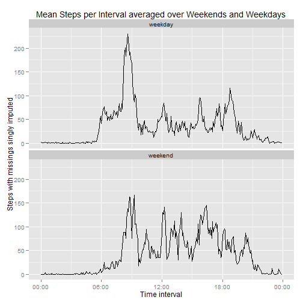

# Course 5 programming asssignment 1

Set up the libraries, and read the data


```r
library(ggplot2)
library(scales)
library(reshape2)
datadir <- "."  # change for other locations
activity <- read.csv(paste(datadir, "/activity.csv", sep = ""), stringsAsFactors = FALSE)
```

## What is mean total number of steps taken per day?

 For this part of the assignment, you can ignore the missing values in the dataset.
 
 * "ignore the missing values" is a bit open ended. The problem is that an empty sum is zero, and we really should distinguish between all missings and a true sum of zero.
 
 * Various threads in the course discussion forum discuss the issue.
 
 * The code below will replace empty sums with ```NA```, prior to further processing 
 
 1. Calculate the total number of steps taken per day

 2. If you do not understand the difference between a histogram and a barplot, research the difference between them. Make a histogram of the total number of steps taken each day

 3. Calculate and report the mean and median of the total number of steps taken per day


```r
StepsPerDay <- tapply(activity$steps, activity$date, sum, na.rm = TRUE)
myfunc <- function(x){ # function to count non-missings and put into tapply
     y <- sum(!is.na(x))
     y}
nonMissingStepsPerDay <- tapply(activity$steps, activity$date, myfunc)
StepsPerDay <- ifelse(nonMissingStepsPerDay == 0, NA, StepsPerDay) # empty sums become NA
```

### the histogram


```r
p <- ggplot(data.frame(StepsPerDay), aes(x = StepsPerDay)) + 
     labs(x = "Steps per day (Bin width 1000)", y = "Count") +
     ggtitle("Total Steps Per Day Histogram \n (Days with no non-missing steps ignored)")
pp <- p + layer(geom = "histogram", binwidth = 1000) + scale_y_continuous(breaks = seq(0, 10, 2))
pp
```

 

### The requested summary statistics


```r
mean(StepsPerDay, na.rm = TRUE)
```

```
## [1] 10766.19
```

```r
median(StepsPerDay, na.rm = TRUE)
```

```
## [1] 10765
```


## What is the average daily activity pattern?

Similar to the earlier situation, there is an interpretation issue. 

* The input times appear as numbers.  In reality they are hhmm strings, pretending to be numbers.

* If the time axis for the plots uses the numbers as is, there will be gaps at the end of every hour. That is, the time 1050 is immediately followed by 1055, but 1055 is immediately followed by 1100. The resulting time series will look funny, at best. The plot in the forked submission site appears to suffer from this problem

* Various threads in the course discussion forum discuss the issue.

* The code below translates the input times to real times, and plot accordingly. 


 1. Make a time series plot (i.e. type = "l") of the 5-minute interval (x-axis) and the average number of steps taken, 
averaged across all days (y-axis)

 2. Which 5-minute interval, on average across all the days in the dataset, contains the maximum number of steps?


```r
MeanStepsPerInterval <- tapply(activity$steps, activity$interval, mean, na.rm = TRUE)
MeanFrame <- data.frame(interval = as.numeric(names(MeanStepsPerInterval)), MeanSteps = MeanStepsPerInterval)
MeanFrame$hm <- sprintf("%02d:%02d", MeanFrame$interval %/% 100, MeanFrame$interval %% 100)
MeanFrame$time <- strptime(MeanFrame$hm, "%H:%M") 
MeanFrame$timec <- as.POSIXct(MeanFrame$time)
```

### The time series plot


```r
q <- ggplot(MeanFrame, aes(x = timec, y = MeanSteps)) + scale_x_datetime(labels = date_format("%H:%M")) +
     ggtitle("Mean Steps Per Interval \nAveraged over Days") + labs(x = "Time Interval", y = "Steps")
qq <- q + layer(geom = "line") 
qq
```

 

### The interval with the maximum number of steps


```r
maxname <- as.numeric(names(which.max(MeanStepsPerInterval)))
timename <- sprintf("%02d:%02d", maxname %/% 100, maxname %% 100)
print (timename, quote = FALSE)
```

```
## [1] 08:35
```

## Imputing missing values

Note that there are a number of days/intervals where there are missing values (coded as ```NA```). The presence of missing days may introduce bias into some calculations or summaries of the data.

 1. Calculate and report the total number of missing values in the dataset (i.e. the total number of rows with ```NA```s)

 2. Devise a strategy for filling in all of the missing values in the dataset. The strategy does not need to be sophisticated. For example, you could use the mean/median for that day, or the mean for that 5-minute interval, etc.

 3. Create a new dataset that is equal to the original dataset but with the missing data filled in.

 4. Make a histogram of the total number of steps taken each day and Calculate and report the mean and median total number of steps taken per day. Do these values differ from the estimates from the first part of the assignment? What is the impact of imputing missing data on the estimates of the total daily number of steps?

### The total number of missings


```r
sum(is.na(activity$steps))  
```

```
## [1] 2304
```

The first step in any missing data imputation is to examine and attempt to understand the missing data pattern. (Reference Little and Rubin, or any other textbook on the subject.)

* The pattern observed here is that either all entries for the day are missing, or all are present. In other words, for some days the step counts simply are not available, but for the remaining days there are no non-missing step counts. 

* The imputation used here is to simply take the mean of each interval, and to impute it for the missing days. In principle one could perhaps try to classify the days, as in the next part of the assignment. In view of the specification that has not been done.


```r
# compute the imputation to be used, and then use it as necessary
activity$imputation <- MeanStepsPerInterval[as.character(activity$interval)]
activity$imputedsteps <- ifelse(is.na(activity$steps), activity$imputation, activity$steps)
```

### The histogram


```r
# Use the graphics code from the first part -- there won't be any NA now
StepsPerDaywithimputation <- tapply(activity$imputedsteps, activity$date, sum)

pi <- ggplot(data.frame(StepsPerDaywithimputation), aes(x = StepsPerDaywithimputation)) + 
     labs(x = "Steps per day (Bin width 1000)", y = "Count") +
     ggtitle("Total Steps Per Day Histogram \n (Missing data singly imputed)")
ppi <- pi + layer(geom = "histogram", binwidth = 1000) + scale_y_continuous(breaks = seq(0, 20, 2))
ppi
```

 

### The requested summary statistics


```r
mean(StepsPerDaywithimputation) # unchanged, as anticipated
```

```
## [1] 10766.19
```

```r
median(StepsPerDaywithimputation) # off by a hair
```

```
## [1] 10766.19
```


Meaning of the summary statistics after imputation

*  The mean is the same as without imputation. Because of the missing data pattern and the single imputation method, this equality was to be anticipated,

* The median is slightly different than previously. There was no reason to expect identity, since now the mean is a potential value for the median. 

* Because of the single imputation, any conclusions drawn from the summary statistics would have misleading precision. No such conclusions were part of this assignment.

## Are there differences in activity patterns between weekdays and weekends?


For this part the ```weekdays() ``` function may be of some help here. Use the dataset with the filled-in missing values for this part.

 1. Create a new factor variable in the dataset with two levels – “weekday” and “weekend” indicating whether a given date is a weekday or weekend day.

 2. Make a panel plot containing a time series plot (i.e. type = "l") of the 5-minute interval (x-axis) and the average number of steps taken, averaged across all weekday days or weekend days (y-axis). See the README file in the GitHub repository to see an example of what this plot should look like using simulated data.

### The time series panel plot


```r
# convert the character string into a date
activity$daytype <- ifelse(weekdays(as.Date(activity$date)) %in% c("Saturday", "Sunday"), "weekend", "weekday")


activitymelt <- melt(activity, id = c("interval", "daytype"), measure.vars = ("imputedsteps"))
str(activitymelt)
```

```
## 'data.frame':	17568 obs. of  4 variables:
##  $ interval: int  0 5 10 15 20 25 30 35 40 45 ...
##  $ daytype : chr  "weekday" "weekday" "weekday" "weekday" ...
##  $ variable: Factor w/ 1 level "imputedsteps": 1 1 1 1 1 1 1 1 1 1 ...
##  $ value   : num  1.717 0.3396 0.1321 0.1509 0.0755 ...
```

```r
graphdata <- dcast(activitymelt, interval + daytype ~ variable, mean)

graphdata$hm <- sprintf("%02d:%02d", graphdata$interval %/% 100, graphdata$interval %% 100)
graphdata$timec <- as.POSIXct(strptime(graphdata$hm, "%H:%M"))
qqq <- ggplot(graphdata, aes(x = timec, y = imputedsteps)) +
     scale_x_datetime(labels = date_format("%H:%M")) +
     ggtitle("Mean Steps per Interval averaged over Weekends and Weekdays") +
     labs(x = "Time interval", y = "Steps with missings singly imputed") +
     layer(geom = "line") + facet_wrap(~daytype, nrow = 2)
qqq
```

 
